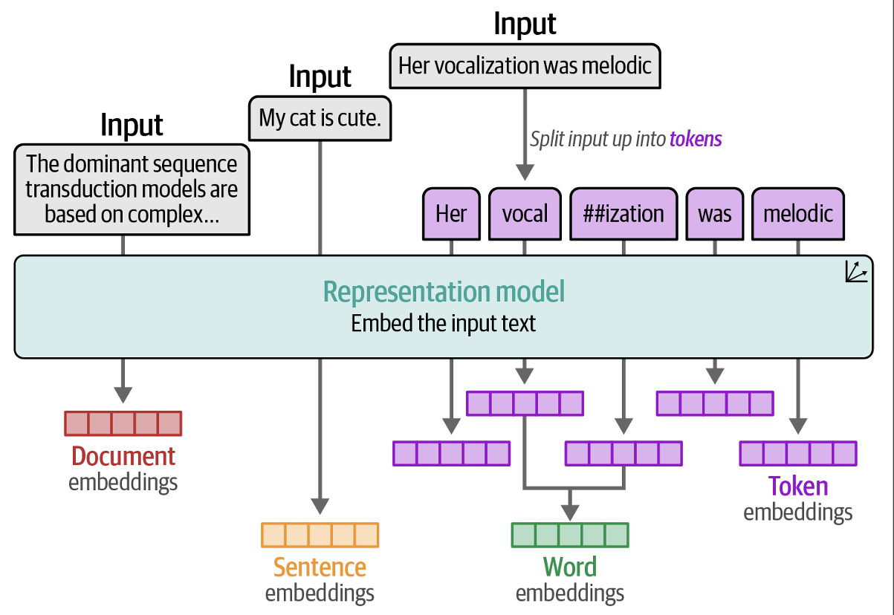

# Large Language Models – From Theory to Practical Applications

**Objective:**
Provide foundational knowledge and hands-on skills to understand, use, and customize Large Language Models (LLMs) for real-world tasks.

**Duration:** \~2 hours (adjustable)

---

## Introduction

### What Are LLMs and Why Are They Important?

- **Language Model (LM):**
  - A statistical model assigning probabilities to sequences of words/tokens.
  - Core task: **Next-token prediction** (predicting the most likely next word/subword given the preceding sequence).
    
- **Large:**
  - Refers to the massive scale in parameters (trainable weights) — billions or even trillions.
  - Examples: GPT-2 (1.5B), GPT-3 (175B), Llama 2 (70B), PaLM 2.
  - Also refers to the vast training datasets (terabytes of text).
- **Large Language Model (LLM):**
  - A deep neural network (specifically, usually a Transformer) trained on massive text data.
  - Designed to understand, generate, and respond to human-like text by learning patterns from data.
  - A specific application of deep learning.
    
- **Core Insight:**
  - The seemingly **simple objective of next-token prediction**, when **scaled massively**, forces the model to **learn complex language structures: grammar, syntax, semantics, context, facts,** and **even some reasoning capabilities** to minimize prediction error across diverse texts.

---

### A Brief History and Key Milestones

- **Statistical Era:**
  - **n-grams:** Simple counts of word sequences (e.g., predicting the next word based on the previous 2-3 words). Limited context.
- **Vector Era:**
  - **Word2Vec, GloVe (circa 2013):** Represent words as dense vectors (embeddings) capturing semantic relationships (e.g., king - man + woman ≈ queen). Static embeddings.
- **Sequential Era:**
  - **Recurrent Neural Networks (RNNs) & Long Short-Term Memory (LSTMs):** Process sequences word-by-word, maintaining a 'memory' (hidden state). Better context handling but struggle with long-range dependencies and vanishing gradients.
    - Before the advent of transformer models, encoder-decoder RNNs were a popular choice for machine translation. The encoder takes a sequence of tokens from the source language as input, where a hidden state (an intermediate neural network layer) of the encoder encodes a compressed representation of the entire input sequence. Then, the decoder uses its current hidden state to begin the translation, token by token.
      
- **The Inflection Point (2017):**
  - **"Attention Is All You Need" paper:** Introduced the **Transformer architecture**. Revolutionized NLP by enabling parallel processing and effective long-range dependency modeling via self-attention.
- **The Rise of Pretrained Models (2018+):**
  - LLM evolution
    
  - **BERT (Bidirectional Encoder Representations from Transformers):** Encoder-only model, excels at understanding tasks (classification, NER). Trained on masked language modeling (predicting hidden words).
  - **GPT (Generative Pre-trained Transformer):** Decoder-only model, excels at text generation. Trained on next-token prediction.
  - **GPT-2, GPT-3, ChatGPT:** Demonstrated remarkable generative capabilities and scaling effects.
- **Application Insight:** The Transformer's parallelizability and effective context handling enabled training much larger models on much more data than previously feasible, leading to breakthroughs in performance and emergent abilities.

---

### Tokenization and Embeddings: The Foundation of LLMs

- **Tokenization:**
  - Breaking raw text into smaller units (tokens) the model can process.
  - Not always words: can be subwords or characters.
  - **Techniques:**
    - **Byte Pair Encoding (BPE):** Common in GPT models. Starts with characters, iteratively merges frequent pairs. Handles unknown words gracefully by breaking them down.
    - **WordPiece:** Used in BERT. Similar to BPE but merges based on likelihood.
    - There are multiple methods of tokenization that break down the text to different sizes of components (words, subwords, characters, and bytes).
      
- **Embeddings:**
  - Converting discrete tokens (or words) into dense numerical vectors.
  - **Purpose:** Capture semantic meaning and relationships in a continuous space suitable for neural networks.
  - **Static vs. Contextual:**
    - Word2Vec/GloVe: **Static** (same vector regardless of context).
    - LLMs (BERT/GPT): **Contextual** (vector changes based on surrounding words, e.g., "bank" in "river bank" vs. "money bank").
      - The values of embeddings represent properties that are used to represent words. We may oversimplify by imagining that dimensions represent concepts (which they don’t), but it helps express the idea.
        
      - Embeddings of words that are similar will be close to each other in dimen sional space.
        
      - Embeddings can be created for different types of input.
        
- **Applications:**
  - Input representation for LLMs.
  - Key component in semantic search, text classification, clustering.

---

### Difference from Traditional NLP

| **Aspect**                           | **Traditional NLP Methods**                                                                                                                                                                                                                                 | **Large Language Models (LLMs)**                                                                                                                                                                                                                                                                        |
| :----------------------------------- | :---------------------------------------------------------------------------------------------------------------------------------------------------------------------------------------------------------------------------------------------------------- | :------------------------------------------------------------------------------------------------------------------------------------------------------------------------------------------------------------------------------------------------------------------------------------------------------ |
| **1. Handling Complexity & Context** | • Excelled at simpler classification/rule-based tasks.<br>• **Bag-of-Words:** Ignored word order and context.<br>• **RNNs/LSTMs:** Limited memory for long-range context; sequential bottleneck.<br>• Struggled with complex generation, nuance, reasoning. | • Excel at complex understanding, generation, and reasoning.<br>• **Contextual Embeddings:** Word meaning adapts to context.<br>• **Self-Attention:** Considers all words simultaneously, capturing long-range dependencies effectively.<br>• Handles diverse tasks within a single model.              |
| **2. Language Representation**       | • **Sparse Representations:** (e.g., One-hot, TF-IDF) High-dimensional, computationally difficult.<br>• **Static Embeddings:** (Word2Vec, GloVe) Dense but context-independent. Meaning captured but fixed.                                                 | • **Dense, Contextual Embeddings:** Rich, nuanced representations learned dynamically.<br>• Model learns syntax, semantics, world knowledge implicitly from data.<br>• Captures relationships between words across long distances.                                                                      |
| **3. Architecture & Training**       | • **Manual Feature Engineering:** Required human expertise to select relevant features.<br>• **RNNs/LSTMs:** Sequential processing, hard to parallelize, vanishing gradients.<br>• **Smaller Datasets:** Limited by computational constraints.              | • **Transformer Architecture:** Based on self-attention, highly parallelizable.<br>• **End-to-End Learning:** Minimal feature engineering needed.<br>• **Massive Datasets & Compute:** Trained on web-scale text using large GPU clusters.<br>• **Self-Supervised Pre-training:** Learns from raw text. |
| **4. Generalization & Scope**        | • **Task-Specific Models:** Required separate training for each task (translation, sentiment, etc.).<br>• Limited ability to generalize to new, unseen tasks without retraining.                                                                            | • **General-Purpose Foundation Models:** Pre-trained once, then fine-tuned or prompted for many tasks.<br>• **Zero-Shot & Few-Shot Learning:** Can perform tasks with no or very few examples.<br>• **Emergent Abilities:** Displays capabilities not explicitly trained for (e.g., arithmetic).        |
| **5. Performance**                   | • State-of-the-art for specific, narrow tasks pre-Transformer.<br>• Performance plateaued on complex tasks.                                                                                                                                                 | • State-of-the-art across a wide range of NLP benchmarks.<br>• Performance continues to improve with scale (data, parameters, compute).                                                                                                                                                                 |

---

## The Core Architecture: The Transformer (Review Last Week Lecture)

### The Problem with RNNs/LSTMs (Recap)

- **Sequential Processing:** Cannot process words in parallel; slow for long sequences.
- **Information Bottleneck:** Tries to compress the entire past sequence meaning into a fixed-size hidden state. Information loss for long dependencies.
- **Vanishing/Exploding Gradients:** Difficulty training very deep sequential models.
  - RNNs are sequential models that process text one token at a time, and each token is dependent on the previous tokens. This means that the model cannot process tokens in parallel, and it is slow for long sequences.
    

---

### The Core Concept: Self-Attention

#### The Revolution: Processing Words in Parallel

- **Big Idea:** Instead of sequence, treat input as a **set of tokens**. Each token can directly look at ("attend to") all other tokens in the input to determine its own contextualized representation.
  - Instead of processing text one token at a time, the model can process all tokens in parallel. This means that the model can process longer sequences faster.
    
- **Analogy:** At a meeting, instead of listening sequentially, you can instantly gauge the importance of everyone's contribution relative to your current point.

#### Mechanism (Scaled Dot-Product Attention)

- For each token, create three vectors via learned linear projections (Weight matrices Wq, Wk, Wv):
  - **Query (Q):** Represents the current token's request for information ("What am I looking for?").
  - **Key (K):** Represents what information other tokens _have_ ("What kind of information do I hold?").
  - **Value (V):** Represents the actual information content other tokens _provide_ ("Here is the information I offer.").
- **Steps:**
  - **Calculate Attention Scores:** Dot product between the Query of the current token and the Keys of all tokens (including itself). Measures relevance/similarity.
    ```math
    Score(Q, K) = \frac{Q * K^T}{\sqrt{d_k}}
    ```
    
    
  - **Normalize Scores:** Apply Softmax to scores to get **Attention Weights** (probabilities summing to 1).
    ```math
    Weights = Softmax(Scores)
    ```
    
    
  - **Compute Context Vector:** Weighted sum of Value vectors, using Attention Weights.
    ```math
    Context = Weights \times V
    ```
    
    
    This context vector is the output for the current token.

---

### The Transformer Block

#### Components

- **Multi-Head Attention:**
  - Runs the self-attention mechanism multiple times in parallel with different learned projection matrices (Wq, Wk, Wv for each "head").
  - Allows the model to jointly attend to information from different representation subspaces (e.g., focusing on syntax in one head, semantics in another).
  - Outputs are concatenated and linearly projected.
    
- **Add & Norm (Layer Normalization):** Adds the input of the sub-layer (residual connection) to its output, then normalizes. Stabilizes training, helps with deep networks.
  
- **Feed-Forward Network (FFN):**
  - Applied independently to each token's representation after attention.
  - Typically two linear layers with a non-linear activation (e.g., ReLU, GELU).
  - Processes the information gathered by the attention layer, adds modeling capacity.
- **Positional Encodings:** Since self-attention ignores order, these vectors are added to the input embeddings to provide information about the position of tokens in the sequence. Can be fixed (sine/cosine) or learned.

#### Architecture Variants (Recap)

- **Encoder-Decoder (Original Transformer, T5, BART):** Sequence-to-sequence tasks (e.g., Translation, Summarization). Encoder processes input, Decoder generates output attending to encoder output.
  
- **Decoder-Only (GPT series, Llama, PaLM):** Autoregressive generation. Each token attends to previous tokens (causal masking). Dominant for generative LLMs.
  
- **Encoder-Only (BERT, RoBERTa):** Bidirectional context understanding. Good for analysis tasks (Classification, NER, Embeddings). Output is contextualized representations, not generated text.
  

---

## The "Large": Scaling Laws & Emergence

### The Scaling Laws (Kaplan et al., Hoffmann et al.)

- **Discovery:** LLM performance (measured by loss on unseen text) scales predictably as a power-law with increases in:
  1.  **Model Size (Parameters, N):** Number of trainable weights.
  2.  **Dataset Size (Tokens, D):** Amount of training text.
  3.  **Compute (FLOPs):** Total floating-point operations used for training.
- **Key Insight:** For optimal performance at a given compute budget, model size and dataset size should be scaled together (Chinchilla scaling laws). Training smaller models on much more data is often better than huge models on less data.
- **Engineering Impact:** Enabled researchers to forecast the performance gains from scaling, justifying the massive investments needed for models like GPT-3/4.

---

### Emergent Abilities

- **Definition:** Capabilities not present in smaller models that _emerge_ abruptly at larger scales. They are not explicitly designed or trained for.
- **Examples:**
  - **Few-Shot / Zero-Shot Learning:** Performing tasks based on instructions/examples in the prompt without fine-tuning.
  - **Arithmetic:** Performing basic math operations.
  - **Reasoning:** Step-by-step logical deduction (Chain-of-Thought).
  - **Common Sense:** Answering questions requiring implicit world knowledge.
- **The Mystery & Hypothesis:** These abilities likely arise because mastering next-token prediction on diverse, complex web-scale data implicitly forces the model to learn underlying structures, facts, and reasoning patterns present in the data.

---

## Using Pretrained LLMs

### Generative Models (GPT-like) and Prompt Engineering

#### Core Mechanism: Autoregressive Generation

- **Objective:** Given a sequence of tokens (prompt), predict the most probable _next_ token.
- Append the predicted token to the sequence and repeat to generate text.
  

#### Prompt Engineering: Guiding the Generator

- The art and science of crafting effective input prompts to elicit desired outputs from an LLM.

#### Basic Components of a Prompt

- **Instruction:** Clear command telling the model what task to perform (e.g., "Summarize this text", "Translate to French", "Write a poem").
- **Context:** Relevant background information the model might need (e.g., the text to be summarized, previous conversation turns).
- **Input Data:** The specific data the instruction applies to.
- **Output Indicator/Format:** Specify how the output should look (e.g., "Output as a JSON", "List the main points", "Sentiment: ").

#### Shot Learning (In-Context Learning)

- **Zero-Shot:** Provide only the instruction, rely on the model's pre-trained knowledge. (e.g., "Translate 'hello' to French.")
- **Few-Shot:** Provide a few examples of the task within the prompt to guide the model. (e.g., "sea otter =\> loutre de mer\\ncheese =\> fromage\\nhello =\> ?")
- 

#### Advanced Prompting Techniques

- **Chain-of-Thought (CoT) Prompting:** Encourage step-by-step reasoning by showing examples or using phrases like "Let's think step-by-step." Helps with math, logic, complex Q\&A.
  
- **Self-Consistency:** Generate multiple reasoning paths (CoT) with randomness (temperature \> 0), then take the majority answer. Improves robustness, especially for reasoning tasks.
  
- **Tree-of-Thought (ToT):** More advanced; explores multiple reasoning paths, evaluates intermediate steps.
  

#### Output Control: Sampling Parameters

- Parameters adjust how the _next token_ is chosen from the probability distribution predicted by the model:
  - **`temperature`:** Scales logits before softmax.
    - Low (\~0.1): More deterministic, focused, less creative (picks high-probability tokens).
    - High (\~1.0+): More random, creative, diverse, potentially less coherent (gives lower-probability tokens a chance).
    - A higher temperature will result in a more random distribution of tokens.
      
  - **`top_p` (Nucleus Sampling):** Selects from the smallest set of tokens whose cumulative probability exceeds `p`. E.g., `top_p=0.9` considers only the most probable tokens that add up to 90% probability. Balances diversity and coherence.
    
  - **`top_k`:** Selects from the top `k` most probable tokens. Simpler alternative to `top_p`.
  - **`max_tokens`/`max_new_tokens`:** Limits the length of the generated response.

---

### Representation Models (BERT-like) and Their Applications

#### Encoder-only Architecture (Recap)

- Processes the entire input sequence simultaneously (bidirectional context).
- Output is a set of contextualized embeddings for each input token, not generated text.
- Excels at understanding meaning and relationships within the input text.

#### Applications

##### **Text Classification:**

- Assigning predefined labels/categories to text (e.g., sentiment, topic, intent).
- 
- **Method:**
  1.  Obtain contextual embeddings for the input text (often using the special `[CLS]` token's embedding from BERT, or pooling token embeddings).
  2.  Feed these embeddings into a simple classifier (e.g., Logistic Regression, small Feed-Forward Network) trained on labeled data.

##### **Semantic Search:**

- Finding documents relevant by _meaning_ rather than just matching keywords.
- 
- **Method:**
  1.  Pre-compute embeddings for all documents in a corpus and store them (e.g., in a vector database).
  2.  Embed the user's search query using the same model.
  3.  Find document embeddings closest to the query embedding in the vector space (using measures like cosine similarity or Euclidean distance).
- **Contrast with Keyword Search:** Keyword search misses synonyms, related concepts; semantic search captures them.

---

### Retrieval-Augmented Generation (RAG)

#### Motivation: Addressing LLM Weaknesses

- **Hallucinations:** Generative LLMs can invent facts or details not supported by their training data.
- **Outdated Knowledge:** Models are static snapshots of their training data; they don't know about events after their training cut-off.
- **Lack of Domain Specificity:** A general model may lack deep knowledge of a specific niche or private dataset.

#### RAG Concept: Grounding Generation with External Knowledge

- Combine the strengths of **retrieval** (finding relevant information from a knowledge source) and **generation** (creating fluent, coherent text).
- 
- Provide the LLM with relevant, up-to-date context _at inference time_ to improve its responses.

#### Workflow

1.  **User Query:** Receive the user's question or prompt.
2.  **Retrieval:** Use the query (or a transformed version) to search an external knowledge base (e.g., internal documents, Wikipedia, web search results) using semantic search (or keyword search, or hybrid). Retrieve the most relevant text chunks/documents.
3.  **Augmentation:** Construct a new prompt for the generative LLM, incorporating the original query _and_ the retrieved documents as context.
4.  **Generation:** The LLM generates an answer based _primarily_ on the provided context, synthesized into a coherent response.

#### Applications & Benefits

- **Fact-Checking / Reduced Hallucination:** Answers are based on retrieved evidence.
- **Access to Current Information:** Can query real-time sources (like web search).
- **Domain-Specific Q\&A:** Chat with your own documents (PDFs, internal wiki, codebases) without retraining the LLM.
- **Citations:** Can potentially cite sources used in the answer.
- **Demo Idea:** Conceptual walk-through of answering a question using a small text document via RAG.

---

## The Training Pipeline: Making LLMs Helpful & Safe

### Phase 1: Pre-training (Creating the Base Model)

- **Objective:** Learn general language understanding and world knowledge. **Predict the next token.**
- **Data:** Massive, diverse corpora of unlabeled text (Common Crawl, books, code, Wikipedia). Billions to trillions of tokens.
  - The pretraining dataset of the popular GPT-3 LLM
    
- **Method:** Self-supervised learning (next-token prediction). Model learns patterns implicitly.
  
- **Result:** A **Base Model** (e.g., GPT-3 base, Llama 2 base).
  
- **Characteristics:** Good at text completion, has broad knowledge, but is not an "assistant." May generate undesirable, unsafe, or unhelpful text. Does not inherently follow instructions well.
  - Example: Prompt "What is the capital of France?" -\> Base Model Completion: "...is a question often asked by tourists visiting Europe. What is the population of France?..."

---

### Phase 2: Supervised Fine-Tuning (SFT) / Instruction Tuning

- **Objective:** Teach the base model to follow instructions and respond in a helpful, conversational manner.
- **Data:** High-quality dataset of **(Instruction Prompt, Desired Response)** pairs. Often human-curated or augmented. Thousands to millions of examples.
  
- **Method:** Continue training the base model using the same next-token prediction objective, but only on the structured instruction-response data. The model learns to generate the "Desired Response" when given the "Instruction Prompt".
  
- **Result:** An **Instruction-Tuned Model** (e.g., InstructGPT, Llama 2 Chat before RLHF/DPO).
- **Characteristics:** Better at following commands, answering questions directly, adopting specific formats or personas. Still may generate unsafe or low-quality responses occasionally.

---

### Phase 3: Alignment (Creating the Assistant Model)

- **Objective:** Refine the model's behavior to align with human preferences, focusing on being **Helpful, Honest, and Harmless (HHH)**. Reduce undesired outputs (bias, toxicity, refusal to answer reasonably).
- **Core Idea:** Learn from human _preferences_ between different possible model outputs.

#### Technique 1: Reinforcement Learning from Human Feedback (RLHF)

1.  **Collect Human Preference Data:** For a given prompt, generate multiple responses from the SFT model. Have human labelers rank these responses from best to worst.
    
2.  **Train a Reward Model (RM):** Train a separate model (often initialized from the SFT model) to predict the human preference score for a given (prompt, response) pair, based on the ranking data.
    
3.  **Fine-tune the SFT Model via Reinforcement Learning (RL):** Use an RL algorithm like Proximal Policy Optimization (PPO) to update the SFT model's parameters. The "reward" signal comes from the trained Reward Model. The model learns to generate responses that maximize the predicted human preference score.
    

#### Technique 2: Direct Preference Optimization (DPO)

- **Motivation:** RLHF is complex and can be unstable to train (requires training multiple models).
- **Method:** A simpler, more direct approach. Uses the same preference data (pairs of chosen vs. rejected responses) but formulates the objective directly in terms of optimizing the language model's likelihood of generating the preferred response over the rejected one, without needing an explicit reward model or RL. Often uses a frozen copy of the SFT model as a reference.
  
- **Result:** An **Aligned Model** (e.g., ChatGPT, Llama 2 Chat).
- **Characteristics:** Generally safer, more helpful, follows instructions more reliably, and better aligns with user expectations compared to just SFT models.

---

## Fine-tuning and Customizing LLMs

### Why Fine-tune? (Beyond SFT/Alignment)

- **Domain Adaptation:** Improve performance on text specific to a field (e.g., medical, legal, finance) where jargon or context differs from general web text.
- **Task Specialization:** Enhance capability for a specific downstream task (e.g., sentiment analysis of _your_ customer reviews, summarizing _your_ meeting notes).
- **Style/Tone Adaptation:** Train the model to generate text in a specific voice or format (e.g., mimic a specific author, output structured JSON).
- **Improved Instruction Following:** Make the model better at adhering to specific, complex instructions relevant to your use case.

---

### Parameter-Efficient Fine-tuning (PEFT)

- **Challenge of Full Fine-tuning:** Retraining _all_ parameters of a massive LLM requires substantial GPU resources (memory and compute) and time, similar to pre-training. Storing a full copy for each fine-tuned task is inefficient.
- **PEFT Idea:** Freeze the vast majority of the pre-trained model's weights and train only a small number of _new_ or _subset_ of parameters.
- **Benefits:**
  - Drastically reduces memory requirements (can fine-tune large models on consumer GPUs).
  - Faster training.
  - Smaller storage footprint (only save the small set of trained parameters, "adapters," for each task).
  - Reduces "catastrophic forgetting" (where fine-tuning degrades performance on general tasks).

#### Popular PEFT Methods:

- **Adapters:** Insert small, trainable neural network modules between existing layers of the frozen pre-trained model.
  
- **LoRA (Low-Rank Adaptation):** Instead of adding new modules, LoRA learns low-rank _updates_ to the existing weight matrices (e.g., attention projections). Freezes original weights `W`, trains small matrices `A` and `B` such that the update is `W + BA`. Very parameter-efficient.
  
- **QLoRA (Quantized LoRA):** Further reduces memory by quantizing the frozen base model weights (e.g., to 4-bit precision) while training the LoRA adapters in higher precision. Enables fine-tuning even larger models on limited hardware.
  
- **Application:** Enables customization of powerful open-source LLMs (like Llama, Mistral) for specific needs on accessible hardware.

---

## Capabilities, Limitations, and Societal Impact

### What LLMs Are Good At

- **Text Generation:** Creating fluent, coherent, and often creative text (prose, poetry, code, scripts).
- **Language Understanding:** Summarization, translation, question answering, sentiment analysis, information extraction.
- **Knowledge Recall:** Accessing and synthesizing information learned during pre-training (though potentially outdated or incorrect).
- **Pattern Recognition & Synthesis:** Identifying complex patterns in text and generating text that follows those patterns (e.g., style imitation, format adherence).
- **Few-Shot Learning:** Adapting to new tasks quickly with minimal examples provided in the prompt.

---

### The "Soft Underbelly" (Limitations & Risks)

- **Hallucinations / Confabulation:** Generating plausible but factually incorrect or nonsensical information with high confidence. Not grounded in real-time truth.
- **Reasoning Failures:** Struggle with complex multi-step logic, mathematics, causality, and planning. Often rely on surface patterns rather than deep understanding.
- **Bias Amplification:** Models learn and can perpetuate societal biases (gender, race, stereotypes) present in the massive, unfiltered training data.
- **Memorization & Privacy:** Can sometimes regurgitate sensitive or copyrighted information verbatim from their training data.
- **Outdated Knowledge:** Static models don't learn continuously; information becomes stale after training. (RAG mitigates this).
- **Lack of Common Sense / World Model:** Debate continues on whether LLMs truly understand concepts or just manipulate linguistic patterns. Often fail on novel situations requiring basic physical or social reasoning.
- **Brittleness / Sensitivity to Prompting:** Small changes in prompt wording can lead to drastically different outputs.

---

### Ethics and Societal Impact

#### The Big Questions & Concerns

- **Job Displacement / Labor Market Disruption:** Automation of tasks involving writing, coding, customer service, analysis, content creation. Need for workforce adaptation.
- **Misinformation & Disinformation:** Potential for generating fake news, propaganda, impersonation at scale, eroding trust.
- **Bias and Fairness:** Deployment can lead to discriminatory outcomes if biases are not mitigated. Reinforces existing inequalities.
- **Copyright and Authorship:** Issues around training data ownership and originality of generated content.
- **Environmental Impact:** Training massive models requires significant energy consumption.
- **Accessibility & Equity:** The "digital divide" – who benefits from and who is harmed by this technology?
- **Over-Reliance & Deskilling:** Potential for atrophy of human critical thinking and writing skills.
- **Transparency & Accountability:** "Black box" nature makes it hard to understand _why_ a model produces a certain output. Who is responsible when an LLM causes harm?
- **The Nature of Understanding:** Philosophical debate – Do LLMs truly understand, or are they sophisticated mimics ("stochastic parrots")? Does it matter for their impact?

---

## The Frontier: What's Next?

### Multimodality: Beyond Text

- **Concept:** Models that can process and generate information across multiple modalities (text, images, audio, video, code).
- **Examples:** GPT-4o, Google Gemini, Meta's Llama models with vision capabilities.
- **Capabilities:** Describe images, answer questions about videos, generate images from text, follow spoken instructions, transcribe audio.
- **Trajectory:** Moving towards models that perceive and interact with the world more like humans do, integrating multiple senses.
- 

---

### Agents & Tool Use: LLMs That Act

- **Concept:** Equipping LLMs with the ability to use external tools to overcome their limitations and interact with the world.
- **Mechanism:** The LLM acts as a "reasoning engine" or "controller." When faced with a task it cannot do internally (e.g., current weather, complex calculation, booking a flight), it decides which tool to use, formulates the input for the tool, executes it (via API calls), and incorporates the tool's output into its response or next step.
  
  
- **Examples of Tools:** Web search engines, calculators, code interpreters, database query engines, calendars, e-commerce APIs.
- **ReAct Framework:** A common pattern where the agent iterates through Thought -\> Action -\> Observation cycles.
- **Trajectory:** Moving from passive text processors to active agents capable of planning and executing multi-step tasks in digital (and potentially physical) environments.

---

### Future Directions

- **Improved Reasoning & Reliability:** Reducing hallucinations, enhancing logical consistency.
- **Personalization & Memory:** Models that learn user preferences and maintain long-term context.
- **Efficiency:** Smaller, faster models with comparable performance (distillation, quantization, new architectures).
- **On-Device LLMs:** Running powerful models locally on phones and laptops for privacy and offline use.
- **Advanced Agentic Systems:** More sophisticated planning, collaboration between multiple agents.

---

## Summary & Key Takeaways

- LLMs are powerful **Transformer-based** neural networks trained on vast text data, primarily via **next-token prediction**.
- Scaling (parameters, data, compute) leads to **emergent abilities** like few-shot learning and reasoning.
- **Self-attention** is the core mechanism enabling parallel processing and long-range context understanding.
- **Prompt Engineering** is crucial for interacting with generative models; **RAG** helps ground them in facts.
- **BERT-like** models excel at understanding (classification, search); **GPT-like** models excel at generation.
- The **Training Pipeline** (Pre-training -\> SFT -\> Alignment (RLHF/DPO)) transforms base models into helpful assistants.
- **PEFT (LoRA/QLoRA)** makes fine-tuning large models accessible for customization.
- LLMs have significant **limitations** (hallucinations, bias) and pose profound **ethical and societal challenges**.
- The future points towards **multimodal models** and **LLM-powered agents** that can interact with tools and environments.
